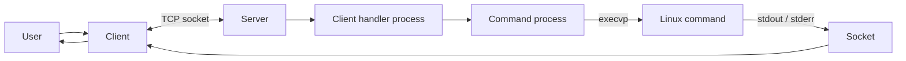
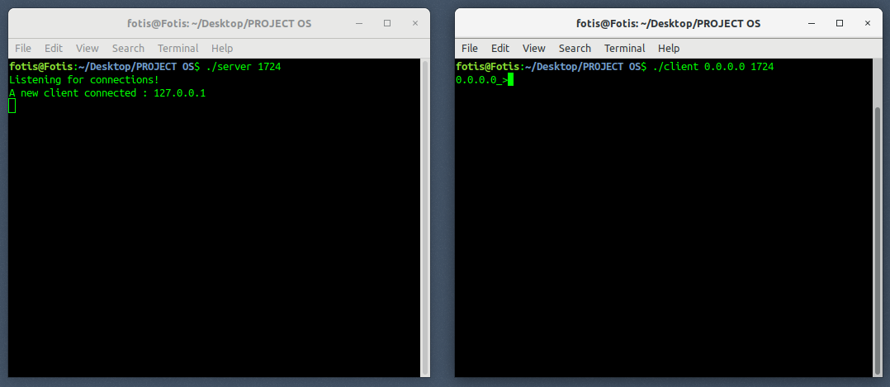
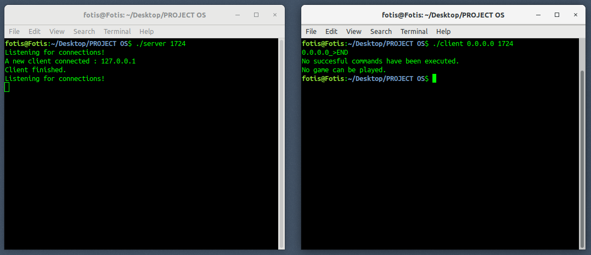
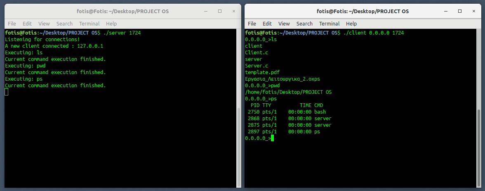
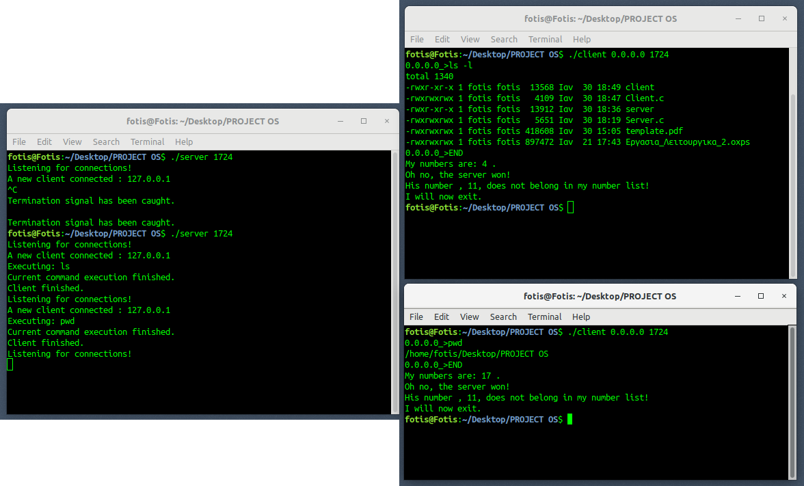

# Unix Remote Shell

A lightweight client-server remote shell written in C, developed as an Operating Systems coursework project at Harokopio University of Athens to explore POSIX processes, TCP sockets, command execution, inter-process communication, signal handling, and I/O redirection.

The application allows a client to connect to a remote server, enter standard Linux commands, and receive the resulting output directly in the client terminal. Commands are executed on the **server machine**, while their `stdout` and `stderr` streams are redirected back through the TCP connection.

> [!WARNING]
> This project was created for educational purposes. It provides **no authentication, encryption, access control, or sandboxing**. Do not expose the server to untrusted networks or the public Internet.

## Overview

The project consists of two programs:

- **Server** - listens for TCP connections, receives commands, creates child processes, and executes commands with `execvp()`.
- **Client** - connects to the server, provides an interactive command prompt, sends commands, and displays the returned output.

The main objective was to combine several low-level Operating Systems concepts into a practical networked application. Rather than executing commands locally, the client acts as a terminal front end while the server performs the actual process creation and execution.

## Features

- TCP client-server communication using POSIX sockets
- Remote execution of standard Linux commands
- Support for command-line arguments and parameters
- Process creation using `fork()`
- Command execution using `execvp()`
- Server-side redirection of command `stdout` and `stderr` to the client socket using `dup2()`
- Repeated command execution within the same client session
- Graceful session termination using the `END` command
- Detection of unexpected server disconnection by the client
- Basic `SIGINT` handling on both applications
- Sequential support for multiple client sessions
- Small client-server number game when a session ends after successful command execution

## Architecture



The server uses two levels of process creation during normal operation:

1. When a client connects, the server creates a child process responsible for that client session.
2. For every command received during the session, another child process is created to execute the requested program.

For ordinary commands, the execution process redirects both standard output and standard error to the connected socket before calling `execvp()`. This allows the command to run on the server while its result appears in the client's terminal.

## Client-Server Communication

The application uses an IPv4 TCP connection based on the standard POSIX socket API.

### Server

The server:

- creates a socket with `socket()`
- binds it to `INADDR_ANY`
- listens for incoming TCP connections
- accepts a client with `accept()`
- creates a process to handle the connected client
- receives command strings with `read()`
- executes them on the server
- redirects command output back to the socket

### Client

The client:

- creates a TCP socket
- connects to the provided server IP address and port
- displays a prompt based on the server address
- sends commands using `write()`
- reads and prints command output as it arrives
- detects when the server closes the connection

The original protocol uses the `|` character as a simple end-of-output delimiter. The client reads the response character-by-character until this delimiter is encountered, avoiding the need to predict the size of a command's output in advance.

## Signal Handling

Both programs install a `SIGINT` handler, but they use it differently.

**Server:** pressing `Ctrl+C` invokes the termination handler and shuts down the server.

**Client:** pressing `Ctrl+C` does not immediately terminate the program. Instead, the client asks the user to disconnect using `END`, ensuring that the server receives the expected session termination message.

If the server disappears while the client is waiting for command output, the client detects the closed socket, reports that the server is no longer running, closes its connection, and exits.

## Session Game

The original coursework specification also includes a small client-server game at the end of a completed session.

For every command considered successfully executed, the client generates a random number between **1 and 20** after `END` is entered. The server independently generates one number in the same range and sends it to the client.

If the server's number appears in the client's generated list, the client wins; otherwise, the server wins.

This feature is separate from the remote-shell functionality but demonstrates additional client-server data exchange before the socket is closed.

## Screenshots

### Connection and Session Handling

| Initial client-server connection | Graceful client disconnect |
| --- | --- |
|  |  |

### Remote Command Execution

| Basic commands | Multiple sessions and end-of-session game | 
| --- | --- |
|  |   |

## Implementation Details

### Command Parsing

Commands are split into whitespace-separated tokens using `strtok()`. The resulting argument vector is passed directly to `execvp()`.

For example:

```text
ls -l /
```

is interpreted approximately as:

```text
argv[0] = "ls"
argv[1] = "-l"
argv[2] = "/"
argv[3] = NULL
```

This provides support for ordinary programs and command-line arguments without invoking an intermediate system shell.

### Output Redirection to the Socket

For normal commands, the server performs:

```c
dup2(newsockfd, STDOUT_FILENO);
dup2(newsockfd, STDERR_FILENO);
execvp(vector[0], vector);
```

As a result, both ordinary command output and execution errors are transmitted through the same connection and displayed by the client.

### Process Management

The project uses `fork()` and `wait()` to separate networking/session handling from command execution. This keeps command execution isolated in child processes while the client session can continue after each command completes.

